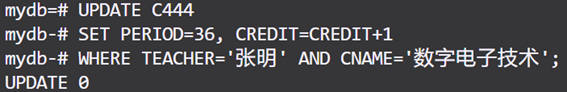

# 数据库课内实验报告

## 一、openGauss的安装

使用本地虚拟机平台VMWare Workstation安装openEuler，在openEuler中安装openGauss

​

为方便操作，后续实验使用vscode通过ssh连接到虚拟机，编写好SQL命令后复制粘贴到集成终端运行

## 二、数据库的创建和基础信息录入

2.1 创建并录入表S444

​

2.2 创建并录入表C444

​

2.3 创建并录入表SC444

​

2.4 查询各表及属性信息

​

## 三、增删改查

### 3.1 查

3.1.1 查询电子工程系（EE）所开课程的课程编号、课程名称及学分数

​

3.1.2 查询未选修课程“CS-02”的女生学号及其已选各课程编号、成绩

​

3.1.3 查询 2004 年～2005 年出生学生的基本信息

​

3.1.4 查询每位学生的学号、学生姓名及其已选修课程的学分总数

​

3.1.5 查询选修课程“CS-01”的学生中成绩第二高的学生学号

​

3.1.6  查询平均成绩超过“王涛”同学的学生学号、姓名和平均成绩，并按学号进行降序排列

​

3.1.7 查询选修了计算机专业全部课程（课程编号为“CS-××”） 的学生姓名及已获得的学分总数

​

3.1.8 查询选修了3门以上课程（包括3门）的学生中平均成绩最高的同学学号及姓名

​

### 3.2 增

分别在S×××和C×××表中加入记录(‘01032005’，‘刘竞’，‘男’，‘2003-12-10’， 1.75，‘ 东 14 舍 312’)及(‘CS-03’，“离散数学”，64，4，‘陈建明’)

​

​

### 3.3 删

将S444表中已修学分数大于60的学生记录删除

​

### 3.4 改

将“张明”老师负责的“数字电子技术”课程的学时数调整为36，同时增加一个学分

​

### 3.5 视图

3.5.1 居住在“东18舍”的男生视图，包括学号、姓名、出生日期、身高等属性

​

3.5.2 张明”老师所开设课程情况的视图，包括课程编号、课程名称、平均成绩等属性

​

3.5.3 所有选修了“人工智能”课程的学生视图，包括学号、姓名、成绩等属性

​

## 四、外部程序接口

### 4.1 数据生成

#### 4.1.1 S表

利用字典的键唯一性生成唯一学号

```python
# 通过字典的键唯一性，快速生成唯一学号
unique_combinations = {}
while len(unique_combinations) < 5000:
    s = rd.randint(10000000,50000000)
    unique_combinations[s] = True  # 键自动去重
```

使用库函数生成符合要求的姓名、性别、生日，其中身高满足正态分布

```python
import mingzi as mz
from faker import Faker

# 生成名字和性别
temp = mz.mingzi(female_rate=0.49, show_gender=True, single_rate=0.3)

# 依据性别生成身高
if (temp[0][1] == "女"):
    row.append(round(rd.gauss(162, 6) / 100, 2))
else:
    row.append(round(rd.gauss(175, 7) / 100, 2))

# 生成生日
row.append(str(fk.date_of_birth(minimum_age=18, maximum_age=22)))
```

随机生成宿舍

```python
# 生成宿舍
dorm = rd.choice(["东 ", "西 "]) + str(rd.randint(1, 24)) + " 舍 "
dorm += str(rd.randint(1, 8) * 100 + rd.randint(1, 30))
```

将生成的数据存入csv文件

```python
with open('stu.csv', 'w', newline='') as file:
    stu = csv.writer(file)
    stu.writerows(rows)
```

#### 4.1.2 C表

从excel表中读取并处理数据

```python
# 读取
code = table.cell_value(r, SH)
# 确定小编号
if (code == '计算机学院'):
    no = "%02d" % (table.cell_value(r, NO) + 5)
elif (code == '信息与电子学院'):
    no = "%02d" % (table.cell_value(r, NO) + 3)
else:
    no = "%02d" % (table.cell_value(r, NO))
# 组合产生课程编号
cno = re.sub("|".join(translate_dict.keys()), translate_func, code) + '-' + no
row.append(cno)
# 读取课程名
row.append(table.cell_value(r, CNAME))
# 读取学时
row.append(table.cell_value(r, PERIOD))
# 读取学分
row.append(table.cell_value(r, CREIDT))
# 读取上课教师
row.append(table.cell_value(r, TEACHER))
```

将生成的数据存入csv文件

```python
with open('course.csv', 'w', newline='') as file:
    course = csv.writer(file)
    course.writerows(rows)
```

#### 4.1.3 SC表

从已生成的S表和C表中读取学号和课程号信息

```python
# 读取学号信息
with open('stu.csv', 'r') as stu_csv:
    reader = csv.DictReader(stu_csv)
    stu_list = [row['s#'] for row in reader]

# 读取课程号信息
with open('course.csv', 'r') as course_csv:
    reader = csv.DictReader(course_csv)
    course_list = [row['c#'] for row in reader]
```

生成不重复的随机组合

```python
# 通过字典的键唯一性，快速生成唯一组合
unique_combinations = {}
while len(unique_combinations) < 200000:
    s = rd.choice(stu_list)
    c = rd.choice(course_list)
    unique_combinations[(s, c)] = True  # 键自动去重
```

成绩应满足正态分布，且有上下界，编写对应的生成函数

```python
# 有上下界的随机正态分布随机函数
def truncated_gauss(mu = 80, sigma = 12, low = 0, high = 100):
    while True:
        num = rd.gauss(mu, sigma)
        if low <= num <= high:
            return num
```

设定低于50分为无记录

```python
for (s, c) in unique_combinations.keys():
    grade = round(truncated_gauss(), 1)
    if grade > 50:
        rows.append([s, c, grade])
    else:
        rows.append([s, c])
```

将生成的数据存入csv文件

```python
with open('sc.csv', 'w', newline='') as file:
    sc = csv.writer(file)
    sc.writerows(rows)
```

#### 4.1.4 生成数据截图

​

### 4.2 JDBC连接

#### 4.2.1 主程序

存储数据库连接信息、数据表名称、需导入的文件（硬编码关键信息仅限测试环境）

```java
public class App {
    private static String JDBC_URL = "jdbc:postgresql:mydb?useSSL=false&characterEncoding=utf8";
    private static String JDBC_USER = "admin";
    private static String JDBC_PASSWORD = "wuhaozhe@12345";
    private static String S_TABLE = "s444";
    private static String C_TABLE = "c444";
    private static String SC_TABLE = "sc444";
    private static String S_CSV = "csv/stu.csv";
    private static String C_CSV = "csv/course.csv";
    private static String SC_CSV = "csv/sc.csv";
}
```

依据不同情景选择创建不同的线程

```java
public class App {
    static void insertOnly(String path, String table, int ins_num) {
        String threadName = "insert_" + table;
        Insert in = new Insert(threadName, path, JDBC_URL, JDBC_USER, JDBC_PASSWORD, table, ins_num);
        in.start();
    }

    static void insertDelete(String path, String table, int ins_num) {
        String threadName1 = "insert_" + table;
        Insert in = new Insert(threadName1, path, JDBC_URL, JDBC_USER, JDBC_PASSWORD, table, ins_num);
        in.start();
        String threadName2 = "delete_from_" + table;
        Delete de = new Delete(threadName2, JDBC_URL, JDBC_USER, JDBC_PASSWORD, table, 200, true);
        de.start();
    }

    static void deleteOnly(String table) {
        String threadName = "delete_from_" + table;
        Delete de = new Delete(threadName, JDBC_URL, JDBC_USER, JDBC_PASSWORD, table, 100, false);
        de.start();
    }
}
```

主函数

```java
public class App {
    public static void main(String[] args) throws Exception {
        Scanner sc = new Scanner(System.in);
        boolean ifContinue = true;
        while (ifContinue) {
            System.out.println("你要进行的操作:");
            System.out.println("1. 录入S");
            System.out.println("2. 录入C");
            System.out.println("3. 录入SC(启用多线程删除)");
            System.out.println("4. 录入SC(禁用多线程删除)");
            System.out.println("5. 删除SC");
            System.out.println("0. 退出");
            switch (sc.nextInt()) {
                case 1: insertOnly(S_CSV, S_TABLE, S_NUM); break;
                case 2: insertOnly(C_CSV, C_TABLE, C_NUM); break;
                case 3: insertDelete(SC_CSV, SC_TABLE, SC_NUM); break;
                case 4: insertOnly(SC_CSV, SC_TABLE, SC_NUM); break;
                case 5: deleteOnly(SC_TABLE); break;
                case 0: ifContinue = false; break;
                default: System.out.println("错误");
            }
            Thread.sleep(1000);
        }
        sc.close();
    }
}
```

#### 4.2.2 Insert线程

采用预编译的方法构造SQL语句，可依据列数动态构造

```java
public class Insert implements Runnable {
    // 构造sql语句
    String structureSQL(int headerNum, String[] headerList) {
        String headLine = headerList[0];
        String ques = "?";
        for (int i = 1; i < headerNum; i++) {
            headLine = headLine + "," + headerList[i];
            ques = ques + ",?";
        }
        String sql = "INSERT INTO " + tableName + " (" + headLine + ") VALUES (" + ques + ")";
        return sql;
    }
}
```

连接数据库，从csv文件读取数据并完成插入操作

```java
public class Insert implements Runnable {
    // 连接数据库
    void connect(String sql, int headerNum, CsvReader csvReader) throws Exception {
        int count = 0;
        // 获取连接
        try (Connection conn = DriverManager.getConnection(JDBC_URL, JDBC_USER, JDBC_PASSWORD)) {
            try (PreparedStatement ps = conn.prepareStatement(sql)) {
                // 从csv文件中读取数据
                while (csvReader.readRecord() && count < INS_NUM) {
                    count++;
                    String[] vs = csvReader.getValues();
                    for (int i = 0; i < headerNum; i++) {
                        String v = (i < vs.length) ? vs[i] : "";
                        // 检查输入数据类型，完成转换
                        if (v == null || v.trim().isEmpty()) {
                            ps.setNull(i + 1, Types.FLOAT);
                        } else if (v.matches("\\d+(\\.\\d+)?")) {
                            if (v.contains(".")) {
                                ps.setDouble(i + 1, Double.parseDouble(v));
                            } else {
                                ps.setInt(i + 1, Integer.parseInt(v));
                            }
                        } else {
                            ps.setString(i + 1, v);
                        }
                    }
                    ps.executeUpdate();
                }
            }
            // 关闭连接:
            conn.close();
        }
    }
}
```

#### 4.2.3 Delete线程

与Insert线程大体相同，不再赘述

#### 4.2.4 插入后截图

在S444表中补充数据至约1000行，在C444表中补充数据至约100行

​

当不启用多线程删除时，所得SC444

​

恢复后使用相同数据源录入，启用多线程删除，所得SC444

​

可见记录减少200条，全部为成绩低于60分（含NULL）的记录

在S444表中补充数据至约5000行，在C444表中补充数据至约1000行

​

在SC444表中补充数据至约200000行

​

### 4.3 更多查询

使用`explain analyse`​分析语句运行时长

1. 查询未选修课程“CS-02”的女生学号及其已选各课程编号、成绩

    ```pgsql
    -- 已有语句
    SELECT S444.S#, C#, GRADE
    FROM S444 LEFT JOIN SC444
    ON S444.S#=SC444.S#
    WHERE SEX='女' AND S444.S# NOT IN (
        SELECT S#
        FROM SC444
        WHERE C#='CS-02'
    );
    
    -- 修改语句
    SELECT S.S#, SC.C#, SC.GRADE
    FROM S444 S
    LEFT JOIN SC444 SC ON S.S# = SC.S#
    WHERE S.SEX = '女'
    AND NOT EXISTS (
        SELECT 1 
        FROM SC444 
        WHERE S# = S.S# AND C# = 'CS-02'
    );
    ```

    `NOT EXISTS`​在找到第一个匹配项后立即停止扫描，而`NOT IN`​需要完整执行子查询，对大表性能更优

    经实测，运行时长从81ms降至50ms
2. 查询 2004 年～2005 年出生学生的基本信息

    ```pgsql
    -- 已有语句
    SELECT *
    FROM S444
    WHERE EXTRACT(YEAR FROM BDATE) BETWEEN 2004 AND 2005;
    
    --修改语句
    SELECT *
    FROM S444
    WHERE BDATE BETWEEN '2004-01-01' AND '2005-12-31';
    ```

    避免使用`EXTRACT(YEAR FROM BDATE)`​函数，让数据库可以直接利用BDATE字段的索引，比使用函数快很多

    经实测，运行时长从1.6ms降至1.1ms
3. 查询选修课程“CS-01”的学生中成绩第二高的学生学号

    ```pgsql
    -- 已有语句
    SELECT S#
    FROM (
        SELECT S#, GRADE, DENSE_RANK() OVER (ORDER BY GRADE DESC) AS grade_rank
        FROM SC444
        WHERE C# = 'CS-01'
    ) AS ranked
    WHERE grade_rank = 2;
    
    -- 修改语句
    SELECT S# 
    FROM SC444
    WHERE C# = 'CS-01'
    ORDER BY GRADE DESC
    LIMIT 1 OFFSET 1;
    ```

    只需一次排序操作，直接利用排序结果跳过第一条记录，性能最优

    经实测，运行时长从29.5ms降至17.5ms
4. 查询选修了3门以上课程（包括3门）的学生中平均成绩最高的同学学号及姓名

    ```pgsql
    -- 原有语句
    SELECT S#, SNAME
    FROM S444
    WHERE S# IN (
        SELECT S#
        FROM (
            SELECT S#, AVG(GRADE) AS AVG_GRADE,
                DENSE_RANK() OVER (ORDER BY AVG_GRADE DESC) AS grade_rank
            FROM SC444
            GROUP BY S#
            HAVING COUNT(*)>=3
        ) AS ranked
        WHERE grade_rank = 1
    );
    
    -- 修改语句
    SELECT S.S#, S.SNAME
    FROM S444 S
    JOIN (
        SELECT S#, AVG(GRADE) AS AVG_GRADE
        FROM SC444
        GROUP BY S#
        HAVING COUNT(*) >= 3
        ORDER BY AVG_GRADE DESC
        LIMIT 1
    ) AS top_student ON S.S# = top_student.S#;
    ```

    只需一次排序操作，通过`LIMIT 1`​直接获取最高平均成绩记录，避免使用窗口函数`DENSE_RANK()`​，减少排序开销

    经实测，运行时长从96ms降至72ms

## 五、备份与恢复

使用gs_dump命令将数据库备份为一个sql文件

​

使用`gsql -d yourdb -f dump/mydb391.sql`​命令恢复合作同学的数据库，成功恢复后查询表设计

```pgsql
-- 查询字段数据类型
SELECT 
    a.attname AS "字段名",
    pg_catalog.format_type(a.atttypid, a.atttypmod) AS "数据类型"
FROM 
    pg_catalog.pg_attribute a
JOIN 
    pg_catalog.pg_class c ON a.attrelid = c.oid
JOIN 
    pg_catalog.pg_namespace n ON c.relnamespace = n.oid
WHERE 
    c.relname = 'sc391'  --表名
    AND a.attnum > 0;
```

​​​

身高、学分等使用定点数，可在保证精度的同时减少资源消耗。学号、课程号使用varchar(10)，为未来可能的位数增加预留空间。课程名长短不一，差别很大，故使用varchar(70)保证足够的长度，同时尽量减少资源浪费。

## 六、触发器

创建记录表并编写触发器

```pgsql
CREATE TABLE BK444 (
    S# VARCHAR(8),
    C# VARCHAR(5),
    GRADE FLOAT4,
    DDATE DATE
);

CREATE OR REPLACE FUNCTION TRI_DELETE_FUNC() RETURNS TRIGGER AS
$$
DECLARE
BEGIN
    INSERT INTO BK444 
    (S#, C#, GRADE, DDATE)
    VALUES (
        OLD.S#,
        OLD.C#, 
        OLD.GRADE,
        NOW()
    );
    RETURN OLD;
END
$$ LANGUAGE PLPGSQL;

CREATE TRIGGER delete_trigger
BEFORE DELETE ON SC444
FOR EACH ROW
EXECUTE PROCEDURE tri_delete_func();
```

使用gsql命令导入

​

删除sc444表后在bk444中保存信息

​

> 在编写java程序时保证了较强的通用性，当需要连接到其他数据库删除数据时只需要修改App类中存储的连接信息并调整对应函数的参数即可，无需重新编写程序

## 七、关于实验的意见与建议

作为网络空间安全专业的学生，可以感知到课业压力明显高于计算机专业的同学（毕业学分要求多20）。本实验内容偏多，占用较多时间，且与日后的工作与学习关系不大。目前主流的关系型数据库是MySQL（MariaDB）、PostgreSQL、Oracle Database等，网安专业学生在进行网络渗透测试时也主要面对这些数据库，因此更应该多学习和熟悉这些主流数据库

建议适度降低对网安专业学生的要求，不强制要求使用openGauss，而允许使用MySQL等更主流的数据库，同时保留本地部署、触发器等高级要求

‍
